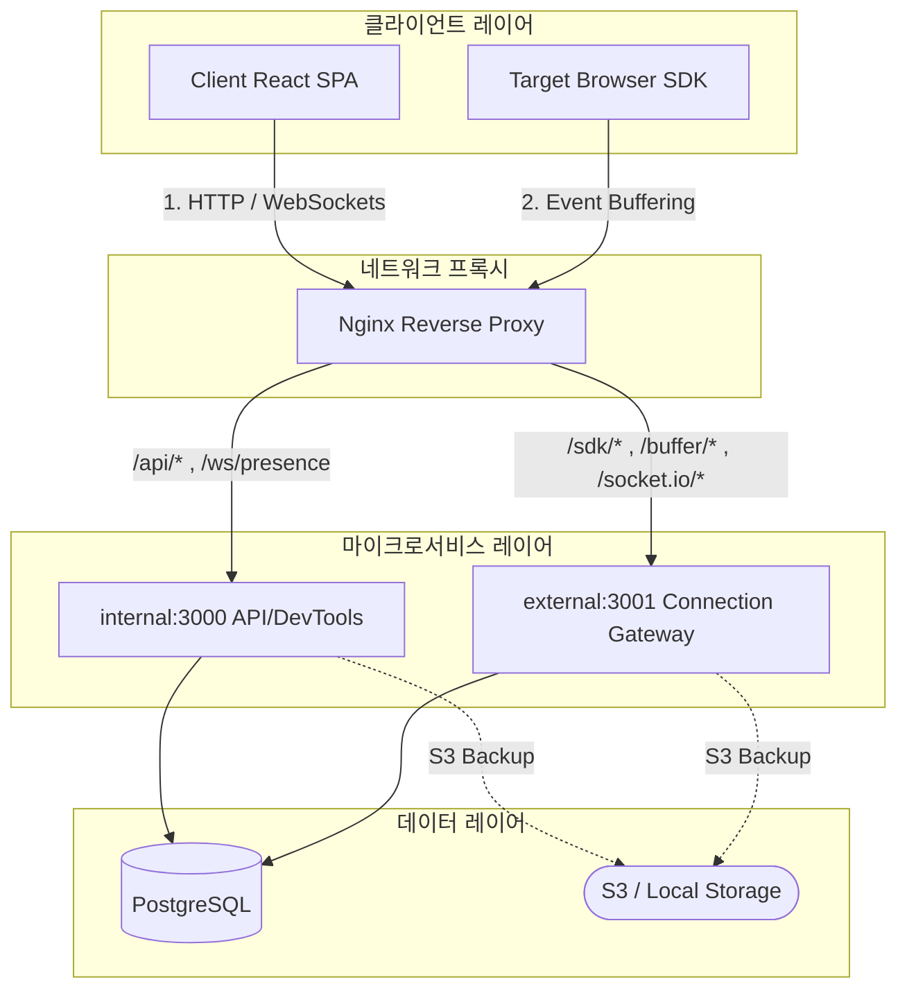
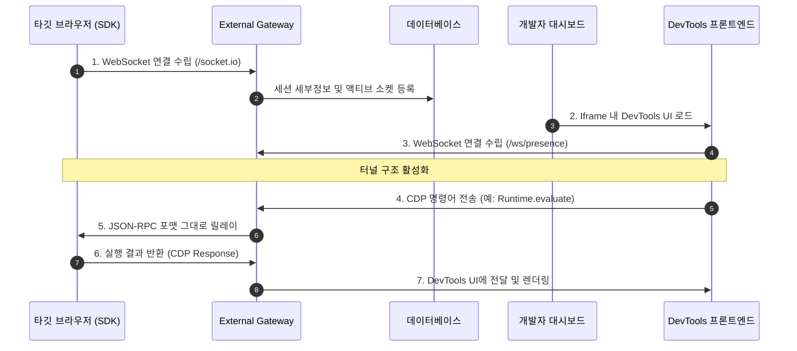
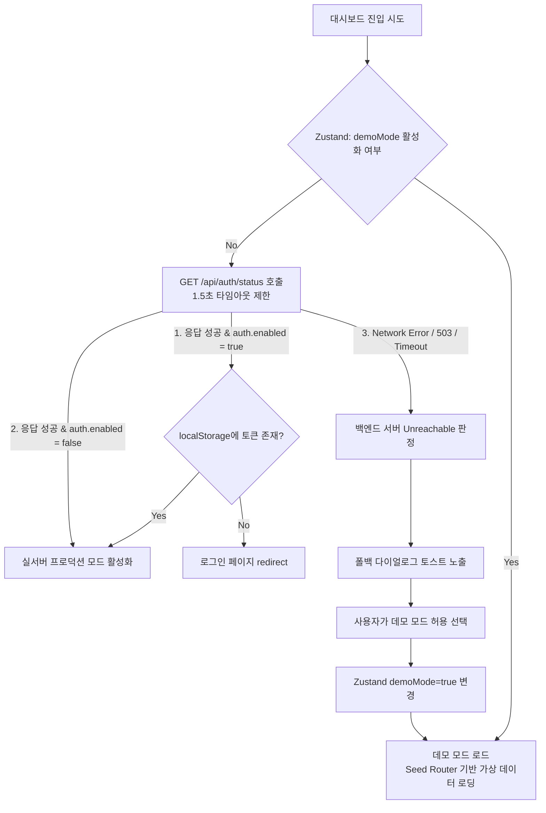

# Remote Devtools Architecture & Core Theory

이 문서는 `remote-devtools` 저장소의 주요 애플리케이션 경계, 시스템 설계, 런타임 토폴로지, 그리고 핵심 통신/장애 복구 메커니즘을 상세히 설명합니다.

---

## 1. 설계 원칙 (Design Principles)

1. **런타임과 UI 분리** - NestJS 서비스는 `apps/`와 `libs/`에서 관리하고, 브라우저 UI는 `client/`, 관리자 UI는 `debug-recorder-admin/`에서 관리합니다.
2. **SDK 독립성 유지** - 외부 소비자가 쓰는 SDK는 `sdk/`에서 별도 빌드/타입 검증이 가능해야 합니다.
3. **플랫폼 공통 코어 유지** - 도메인 모델, 엔티티, 공통 타입, 상수는 `libs/` 아래 패키지로 공유합니다.
4. **검증 명령 표준화** - 루트 `verify`는 format, lint, typecheck, test, backend build를 포함하는 기본 품질 게이트입니다.

---

## 2. Workspace 구조 (Workspace Directory Map)

```text
apps/
├── remote-platform-internal/   내부 API 애플리케이션 (포트 3000)
└── remote-platform-external/   외부 API 애플리케이션 (포트 3001)
libs/
├── common/                     공통 유틸리티 & i18n
├── constants/                  런타임 상수
├── core/                       핵심 도메인 로직 (TypeORM 연결, 서비스 계층)
├── entity/                     TypeORM 엔티티 정의
└── interfaces/                 공유 인터페이스
client/                         React 클라이언트 대시보드
debug-recorder-admin/           관리자 프론트엔드
sdk/                            외부 연동 SDK (UMD/ESM 빌드)
figma-plugin/                   Figma 플러그인
devtools-frontend/              크롬 개발자 도구 프론트엔드 자산
```

---

## 3. 시스템 런타임 토폴로지 (Runtime Topology)

Remote DevTools는 고성능 실시간 원격 디버깅을 지원하기 위해 **리버스 프록시 게이트웨이(Nginx)**와 **3티어 마이크로서비스 설계**로 유기적으로 통신합니다.



### 주요 컴포넌트 역할:

- **Nginx Gateway**: 단일 진입점(80/443 포트)을 구성하고 요청 경로에 따라 정적 리소스 서빙, 내부 API 프록시, 외부 실시간 게이트웨이 웹소켓 통신을 분배합니다.
- **Internal Core Service**: 관리자 기능, 통계 계산, 세션 메타데이터를 서빙하고 크롬 DevTools 프론트엔드 소스를 제공합니다.
- **External SDK Gateway**: 타깃 SDK들로부터 유입되는 DOM 변화 스냅샷 및 CDP 프로토콜 이벤트를 수집/전달하는 고신뢰 웹소켓 관문 역할을 합니다.

---

## 4. 핵심 동작 원리 및 이론 (Core Implementation Theory)

### 4.1. CDP (Chrome DevTools Protocol) 터널링 및 웹소켓 중계

타깃 브라우저의 디버깅 세션을 원격지에 위치한 개발자 도구 화면으로 실시간 중계하는 핵심 파이프라인입니다.



1. **실시간 원격 진단**: 타깃 기기에 설치된 SDK가 External Gateway와 지속 연결을 수립하면, Gateway는 해당 소켓 식별자 및 세션 상태를 저장소에 등록합니다.
2. **프로토콜 중계**: 개발자 대시보드 내의 DevTools Frontend Iframe이 활성화되면 개발자 소켓이 형성되고, 둘 사이의 모든 제어 신호(CDP JSON-RPC)는 Gateway에 의해 디코딩/인코딩 없이 고속 바이패스 릴레이됩니다.

### 4.2. 데이터 버퍼링 및 수집 최적화 (SDK Client-Side)

- 브라우저의 성능 저하를 방지하기 위해 SDK는 rrweb 이벤트 및 콘솔 에러 로그를 한 프레임씩 실시간 전송하지 않습니다.
- SDK 내부의 메모리 버퍼에 데이터를 누적한 뒤, 버퍼가 가득 차거나 설정된 주기(예: 500ms)가 도달하면 외부 버퍼 플러시 API(`/buffer`)로 **벌크 전송(Bulk Flush)**하여 네트워크 오버헤드를 제어합니다.

### 4.3. 메모리 캐시 축출 정책 (S3 Playback Eviction)

- S3 백업 스토리지로부터 지난 녹화 세션을 리로드할 때 디스크/네트워크 지연을 감쇄하기 위해 서버 내에 메모리 맵 캐시(`Map<string, unknown>`)를 탑재합니다.
- 메모리 포화 방지를 위해 캐시 저장 한도(`maxS3CacheSize`)를 추적하고, 한계 도달 시 가장 먼저 들어왔던 캐시 엔트리를 제거하는 **FIFO(First-In, First-Out) 알고리즘**을 수행해 안정적인 자원 관리를 유지합니다.

---

## 5. 런타임 제어 및 장애 복구 엔진 (Fallback Flow)

클라이언트 대시보드는 런타임 환경 상태를 판단하여 백엔드 접근 차단 시 데모 모드로 유연하게 전환하는 복구 엔진을 탑재하고 있습니다.



- **Zustand 전역 상태 저장소**: `demoMode` 전역 변수가 바인딩되어 페이지가 마운트될 때마다 최우선 감지됩니다.
- **API 호출 가로채기 (`apiFetch`)**: 모든 REST API와 쿼리 호출 계층은 `isDemoMode()` 상태를 조회하여, 활성화 시 **Lazy-Loaded Seed Router** 컴포넌트로 요청을 리다이렉트함으로써 브라우저 리소스를 보호하고 백엔드 응답을 정교하게 모방합니다.
- **프로빙 실패 복구**: 실서버가 연결 유실되면 로그인 화면 및 내부 페이지에서 즉각 경고 토스트와 함께 데모 모드로 전환할 수 있는 연결 단추를 제공해 사용자가 작업을 연속해서 탐색할 수 있게 지원합니다.
